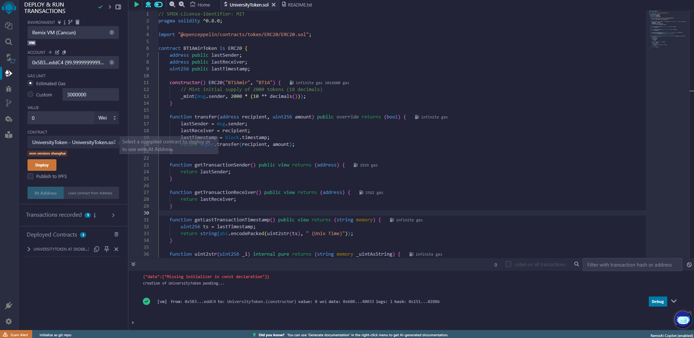
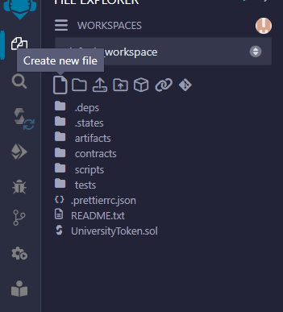
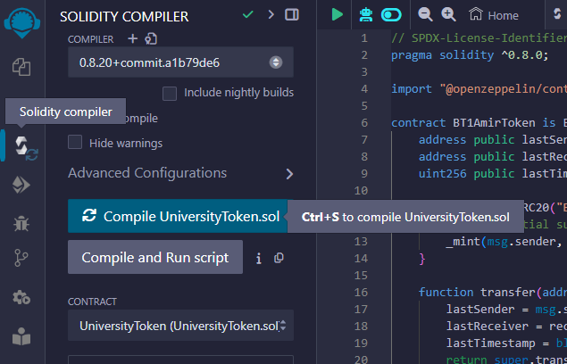
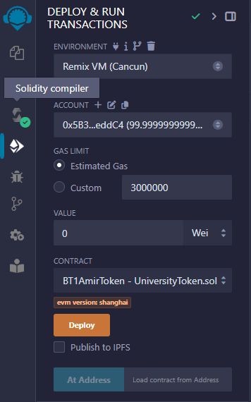

# UniversityGroupToken ERC-20 Token

## Description
This repository contains an ERC-20 token implementation for the `<University_name_your_Group_name>` project.

## Features
- Initial supply of 2000 tokens.
- Retrieve and display transaction details.
- Fetch transaction sender and receiver addresses.
- Get human-readable timestamp of the latest transaction.

## Usage
1. Deploy the contract on a testnet using Remix and MetaMask.
2. Interact with the token through the contract functions.

### Deployment
1. Open the [Remix IDE](https://remix.ethereum.org/).

2. Paste the smart contract code into a new file (`BT1AmirToken.sol`).

3. Compile the contract using Solidity version `0.8.x`.

4. Deploy.

## Examples
- Transfer tokens: `transfer(address recipient, uint256 amount)`
- View transaction: `getTransaction(uint256 index)`

## License
[MIT License](./LICENSE)
